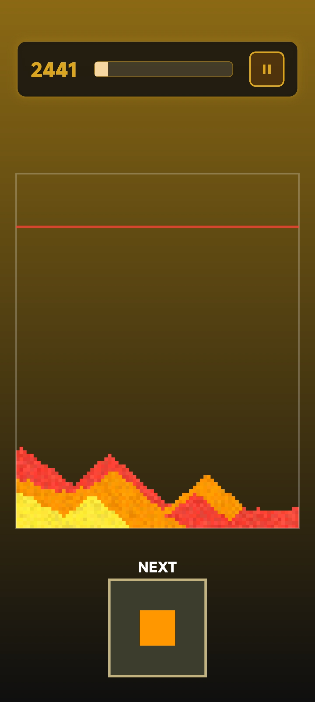
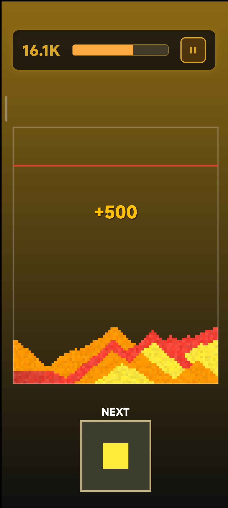
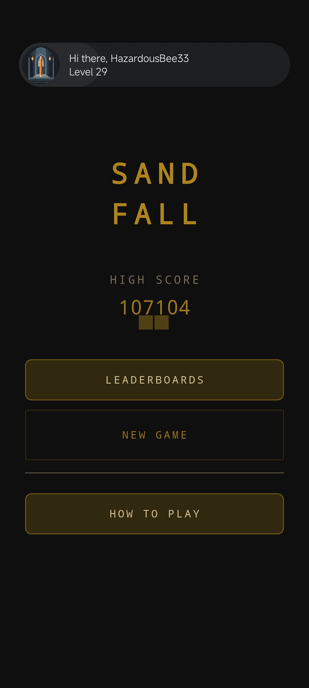
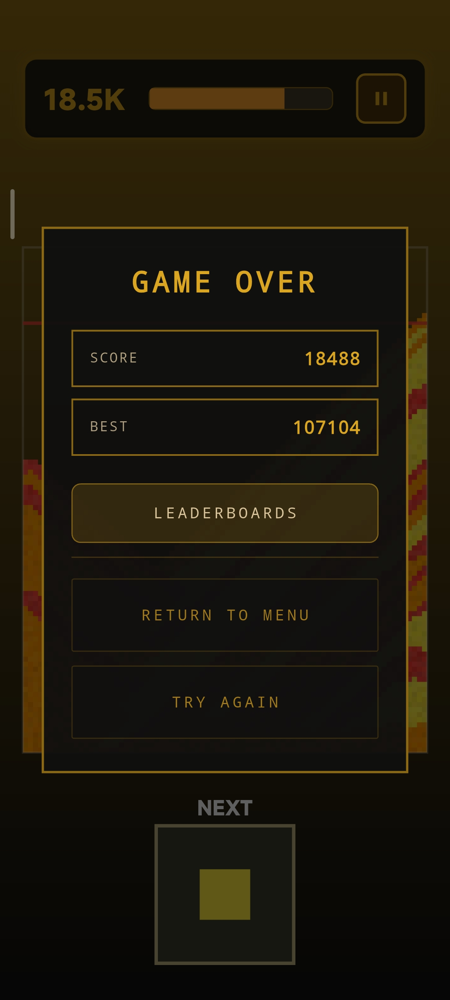
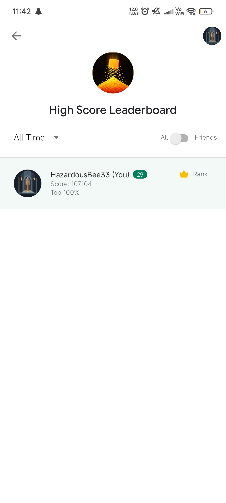
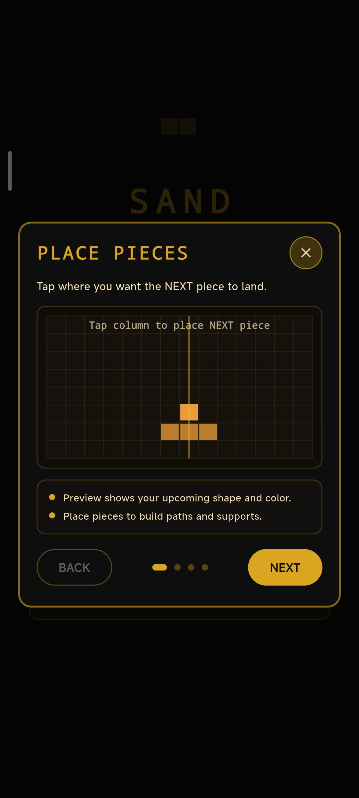

# Sand Fall

> Sand Fall is a Flutter and Flame puzzle game about placing sand, letting the board settle, and creating same-color bridges that span left to right.

## Screenshots

A selection of in-game screenshots:

| | | |
|---|---|---|
|  |  |  |
|  |  |  |


## Overview

The game combines cluster-based gravity, batched rendering, and sparse save data to keep the experience fast while still allowing the board to fragment, settle, and clear in interesting ways.

## Highlights

- Physics-driven puzzle loop with cluster-based gravity and fragmentation.
- Bridge clearing that rewards left-to-right connections of the same color.
- Batched vertex rendering for efficient drawing on a large grid.
- Local save system using Hive for high score and resume support.
- Performance profiling notes and optimization work documented in `docs/performance_optimization.md`.

## Tech Stack

- Flutter / Dart
- Flame
- Hive
- Android, iOS, Linux, macOS, Windows, and web targets supported by Flutter

## Gameplay

- Tap or click a cell to place the next sand chunk.
- Pieces fall under cluster-based gravity and can break into smaller grains.
- Once the board stabilizes, a connected same-color bridge that reaches from the left edge to the right edge clears.
- Score comes from placements, clears, and combo bonuses.
- New colors unlock as score milestones are reached.

## Controls

- Tap or click a cell to place the next piece when the board is stable.
- Use the Pause button in the HUD to pause, resume, or restart.

## Save Data

This project uses Hive for local persistence.

- High score is stored across sessions.
- Saved game state is stored periodically so the main menu can offer Continue.

## Local Setup

### Requirements

- Flutter SDK matching the version constraint in `pubspec.yaml`.

### Install

```bash
flutter pub get
```

### Run

```bash
flutter run
```

### Platform examples

```bash
flutter run -d chrome
flutter run -d linux
flutter run -d android
```

## Development

### Static analysis

```bash
flutter analyze
```

### Tests

```bash
flutter test
```

## Project Structure

- `lib/main.dart` - app bootstrap, Hive initialization, and Flame overlay setup
- `lib/game.dart` - main game loop, rendering, input, and save/load orchestration
- `lib/world.dart` - grid buffers, physics, bridge clearing, and game-over logic
- `lib/services/` - scoring, difficulty, milestone, and persistence services
- `lib/ui/` - menu, HUD, pause, celebration, and game-over overlays

## Release Builds

Android release signing is configured from a local `android/key.properties` file and private keystore. Those files are intentionally not committed.

## License

This project is licensed under the MIT License. See `LICENSE` for details.
